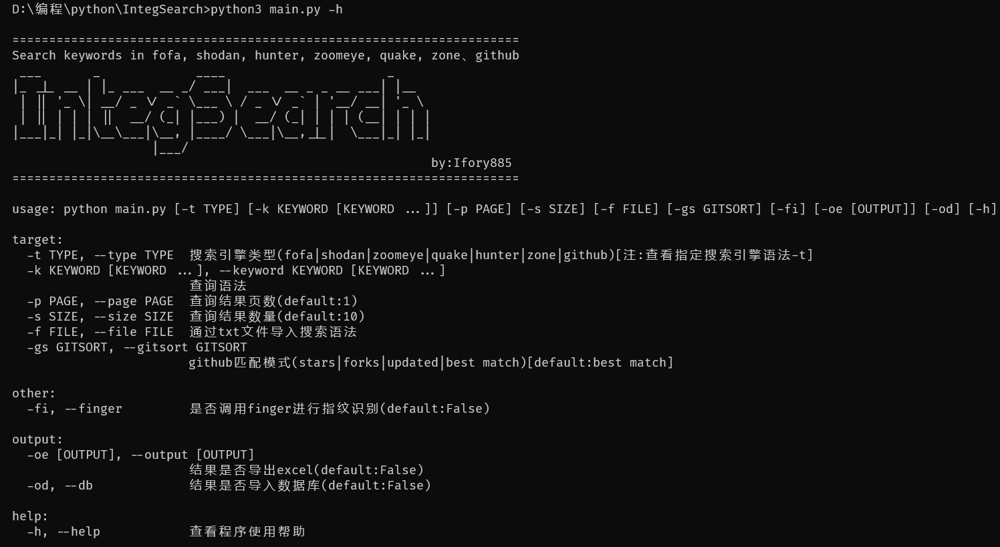
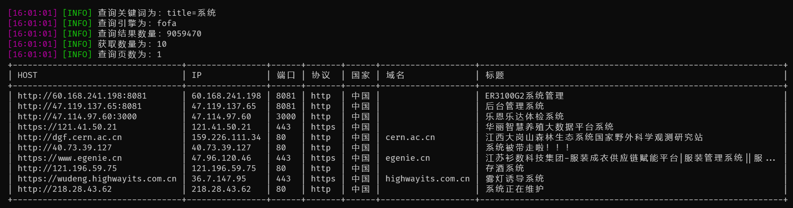
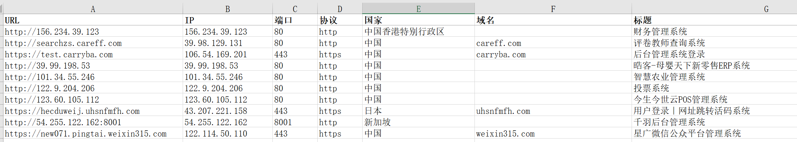
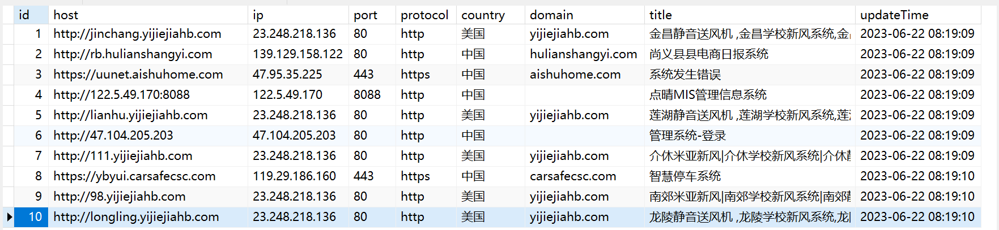

<h1 align="center">IntegSearch</h1>

<h3 align="center">集成6款网络空间搜索引擎及github搜索引擎聚合搜索工具</h3>

<h5 align="center">fofa、shodan、hunter、zoomeye、quake、zone(零零信安)、github</h3>

<p align="center">
    <a href="https://github.com/Ifory885/IntegSearch"></a>
    <a href="https://github.com/Ifory885/IntegSearch"></a>
    <a href="https://github.com/Ifory885/IntegSearch"></a>
    <a href="https://github.com/Ifory885/IntegSearch"></a>
    <a href="https://github.com/Ifory885/IntegSearch"></a>
    <a href="https://github.com/Ifory885/IntegSearch"></a>
</p>

## 前言

​	为了更方便有效的进行信息搜集，此脚本集成了市面上常见网络空间搜索引擎的API，可以统一进行搜索、结果展示、结果保存。

此外还集成优秀的指纹识别工具finger，对搜索到的结果进行请求，判断资产是否真实存在。

​	此脚本集成github仓库搜索的API，可按照更新时间、tars数量、forks数量、最佳匹配维度对关键字搜索结果进行展示。

## 环境配置

* 使用前应确保是否安装对应的库文件。

```
pip install -r requirements.txt
```

* 在根目录config.yaml文件中填写相对应的配置信息。
* 直接运行 python 脚本或使用 `-h` 参数可以查看功能列表。



## 使用方法

### 单一搜索

使用参数-t指定搜索引擎， 参数-k指定搜索语法

```
python3 main.py -t fofa -k title=系统
```

### 批量搜索

使用参数-f 指定导入关键字的txt文件。

```
python3 main.py -t fofa -f key.txt
```

### 多条件搜索

使用双引号包围搜索的关键字（使用文件导入时则无需双引号包围）。

```
python3 main.py -t fofa -k "title="系统" && port=443"
```

### 搜索数量

使用参数 -s 指定搜索结果的数量。（默认10条）【配置文件中修改默认条数】

使用参数 -p 指定从第几页开始搜索。（默认第1页）

```
python3 main.py -t fofa -k title=系统 -s 100 -p 2
```

### finger指纹识别

集成finger指纹识别功能，使用参数 -fi 对结果进行指纹识别。

```
python3 main.py -t fofa -k "title=系统 && port=443" -fi
```

### github查询

集成github仓库搜索功能，使用参数 -gs指定搜索的维度。（结果暂只可显示，不可导出）

```
python3 main.py -t github -k 免杀 -gs updated	  (注：-gs参数可省略，默认:best match)
```


### 搜索语法查询

集成各个平台的搜索语法，当使用参数 -t 指定平台名称 (github不支持) 并且不使用 -k 及 -f 参数时进行查询。

```
python3 main.py -t fofa
```

### 结果输出

#### 格式化显示

使用PrettyTable库进行格式化输出。



#### excel保存

使用参数 -oe结果导出为xlsx文件。

```
python3 main.py -t fofa -k title=系统 -oe
```



#### mysql数据库保存

使用参数 -od结果导入mysql数据库中。

```
python3 main.py -t fofa -k title=系统 -od
```



## 后续更新

后续对功能进行进一步完善，并提高脚本稳定性，有什么问题和建议可以在issue中提出。

## 免责申明

由于传播、利用开源信息而造成的任何直接或间接的后果及损失，均由使用者本人负责，作者不承担任何责任。 开源仅作为安全研究之用！切勿用作实战用途！