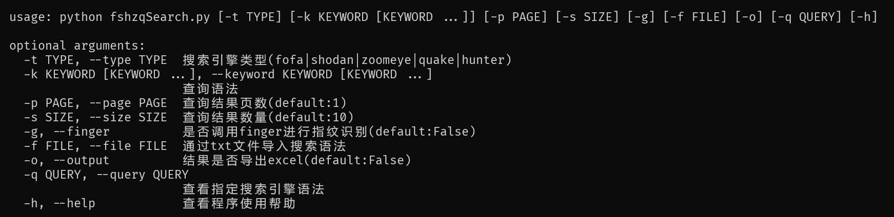
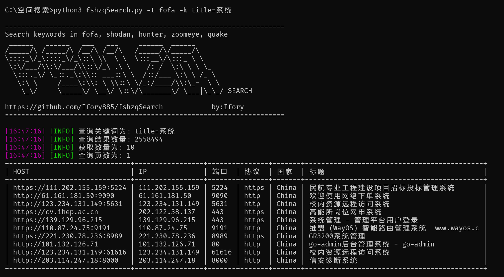
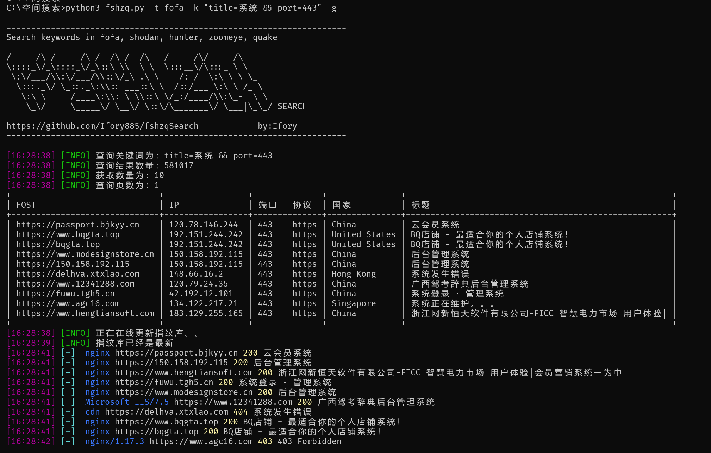
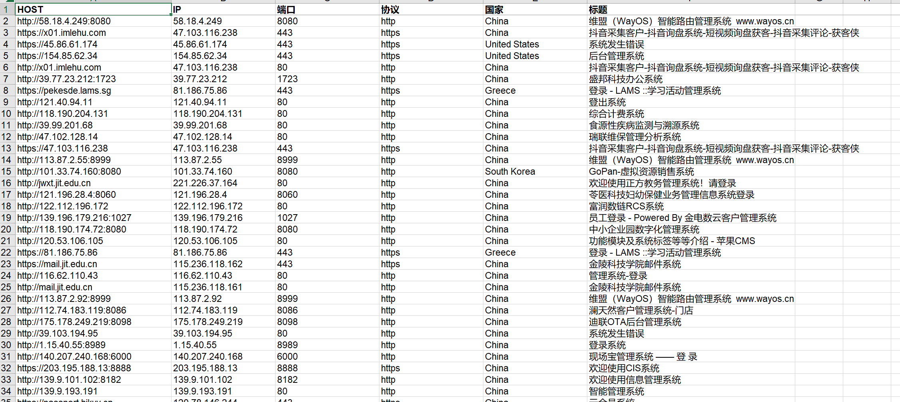

<h1 align="center">fshzqSearch</h1>

<h3 align="center">集成5款网络空间搜索引擎聚合搜索工具</h3>

<p align="center">
    <a href="https://github.com/Ifory885/fshzqSearch"></a>
    <a href="https://github.com/Ifory885/fshzqSearch"></a>
    <a href="https://github.com/Ifory885/fshzqSearch"></a>
    <a href="https://github.com/Ifory885/fshzqSearch"></a>
    <a href="https://github.com/Ifory885/fshzqSearch"></a>
    <a href="https://github.com/Ifory885/fshzqSearch"></a>
</p>


## 环境要求

1、使用前应确保是否安装对于的库文件。

```
pip install -r requirements.txt
```

2、直接运行 python 脚本或使用 `-h` 参数可以查看功能列表。



3、在config目录下的config.py文件中填写搜索引擎的API KEY。

## 使用方法	

### 单一搜索

使用参数-t指定搜索引擎， 参数-k指定搜索语法

```
python3 fshzqSearch.py -t fofa -k title=系统
```



### 批量搜索

使用参数-f 指定导入关键字的txt文件。

```
python3 fshzqSearch.py -t fofa -f key.txt
```

### 高级搜索

使用双引号包围搜索的关键字。

```
python3 fshzqSearch.py -t fofa -k "title="系统" && port=443"
```

### 搜索数量

使用参数 -s 指定搜索结果的数量。（默认20条）

使用参数 -p 指定从第几页开始搜索。（默认第一页）

```
python3 fshzqSearch.py -t fofa -k title=系统 -s 100 -p 2
```

### finger指纹识别

集成finger指纹识别功能，使用参数-g 对结果进行指纹识别。

```
python3 fshzqSearch.py -t fofa -k "title=系统 && port=443" -g
```



### 搜索语法查询

集成各个平台的搜索语法，使用参数 -q指定平台名称进行查询。

```
python3 fshzqSearch.py -q fofa
```

### 结果保存

暂时只支持导出为xls文件，使用参数 -o结果导出为xls文件。

```
python3 fshzqSearch.py -t fofa -k title=系统 -o
```



## 后续更新

后续对功能进行进一步完善，增加一些小功能，并提高脚本稳定性，有什么问题和建议可以在issue中提出。